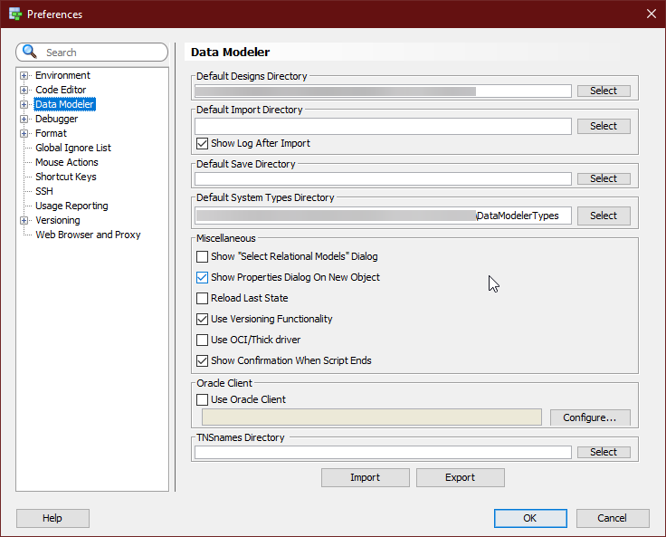

# ODMScripts

This repository contains the Oracle Data Modeler Scripts for accelerated data modeling using Oracle Data Modeler. It's really crucial to follow some coding guidelines for faster Data Modeling and create models optimized for proper data model documentation.

For using these scripts, first you must have the data modeler downloaded or installed on your machine. For more information on data modeler, please visit the [link](https://www.oracle.com/tools/downloads/sql-data-modeler-downloads.html) to download the Oracle Data Modeler.
 
You must be knowing the basics of data modeling. You can then use the following scripts to perform some common tasks to build your model. Also yes you can build your model from a simple CSV.

Please note that this is tested for the following version of JAVA -

```
openjdk 11.0.8-internal 2020-07-14
OpenJDK Runtime Environment (build 11.0.8-internal+0-adhoc..jdk11u)     
OpenJDK 64-Bit Server VM (build 11.0.8-internal+0-adhoc..jdk11u, mixed mode)
```

## Setting up the path to the DataModelerTypes

Git clone this repo. Update the preferences in the modeler to point it to the directory where this repo is cloned. For updating the path -

```
Tools --> Preferences --> Data Modeler
```

Please see the screenshot below -



Once done, restart your data modeler. Once modeler is restarted go to the following path -

```
Tools --> Design Rules and Transformations --> Transformations
```


Alternately you can also press `Alt + Shift + F`. Please note that when you make the change to the default path comes with Oracle Data Modeler additional two things will change for you -

* **Database types:** Any of the custom types you set, for those _types.xml_ file is created by the data modeler or other words the information is saved in this file.
* **Datamodeler Settings:** Any of the custom current design level settings you had created will also get overwritten as that information is saved in the _dl_settings.xml_.
* **Default Domains:** Information about default domains is saved in the _defaultdomains.xml_ file. You create domains for creating a reusable data type across all of your models **_e.g._** `Address`, you can set the data type for this as VARCHAR(200) and use this data type across all of your entire data models.
* **Custom Report Templates:** If any of the custom report report templates you had wrote, make sure to replace the file with the custom templates you had created. The file for the same is _custom_report_templates.xml_.

Now lets look at what are the scripts do.

## Transformations Scripts
### All Names in Title Case(For An Entity)

Script changes the names for all the attributes to `Title Case` for an entity.

### All Names in Title Case(For Entire Logical Model)

Script changes the names for all the attributes for all the entities in the logical model to `Title Case` for an entity.

### Bulk Set Domain For Attribute

Based on the attribute which is asked as an input you can set the domain. Make sure the domain is pre-created. **e.g.** For any attribute with the name as `Address` the domain can be set to `Address`

### Bulk Set Domain For Attribute - Using CSV

Provided a CSV file in the format below, the domain can be set for the `Entity.Attribute`. The CSV should have the following attributes -

### Bulk Set Null to attribute in all entities

For the attribute asked as an input, the attribute can be set to _nullable_ in all the entities in which the attribute was found.

### Bulk Set Null to entity attribute - Using CSV

Provided a CSV file in the format below, the _nullability_ can be set for all `Entity.Attribute`. The CSV should have the following attributes -

### Bulk Set RDBMS Comments From Blank To Attribute Name

The RDBMS Comments for an attribute if not provided or blank can be just set to the attributes name by running this script.

### Bulk Set RDBMS Comments to the Entity - Using CSV

Provided a CSV file in the format below, the _RDBMS Comments_ can be set for all _Entities_. The CSV should have the following attributes -

### Bulk Set RDBMS Comments to the Entity Attribute - Using CSV

Provided a CSV file in the format below, the _RDBMS Comments_ can be set for all _Entities_. The CSV should have the following attributes -
